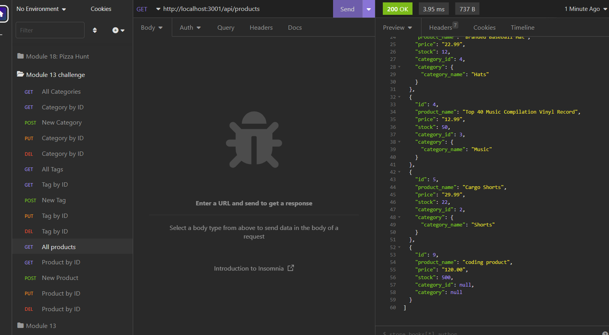

# ecommerce-orm

## Project Description

This is a backend api project for an eccomerce app. The API is hooked up to mock data including products, categories, product-tags.

The application is allows the user to test the api endpoints for a variety of different queries, additions, edits, and deleting.

The endpoints are setup and work to be added if a front-end design is developed.

## Tools Used In This Project

* JavaScript
* Express
* RESTful APIs
* Sequelize
* mySQL
* dotenv

## Future Development

* I would like to develop a front end for this project to connect and server a UI experience

* I would also like to create a few more tables to test more queries

## Deployed Application

The application can be found on my github at:

https://github.com/bsovic23/employee-tracker

## Screenshots Of The Application

